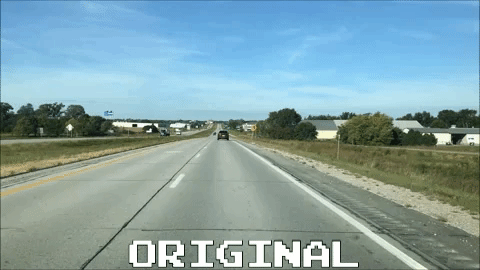
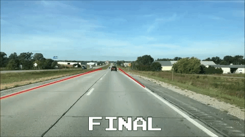

# Lane-Detection-OpenCV
A simplistic lane detection software in OpenCV

This repository outlines a side project I completed my final semester of college. The program will take a pre-recorded video, analyze the video frame-by-frame, and output the analyzed images to a specified folder.

