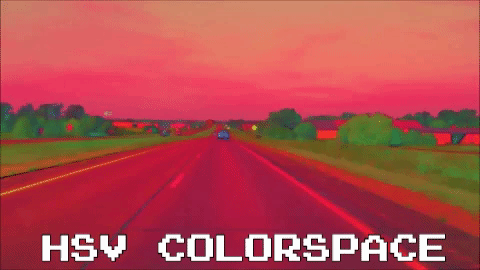

# Lane-Detection-OpenCV
A simplistic lane detection software in OpenCV

This repository outlines a side project I completed my final semester of college. The program will take a pre-recorded video, analyze the video frame-by-frame, and output the analyzed images to a specified folder.

The first gif below shows the original, unedited version of the video. The next frame showcases the video converted to the HSV colorspace. I used the HSV colorspace to find the left most lane line. As you can see, it distinctly stands out from the rest of the colors in the video. Once I collected all of the relevant lane line data from the original frame and the HSV frame, I used the canny edge finding algorithm to find the edges of each of the lane lines. The third gif is the result from the Canny algorithm. I averaged the slope and locations of the edges and used a Hough Line Transform to plot lines onto the image. These lines ran over the lane lines. The final gif shows the final solution.

  
  
  
  

